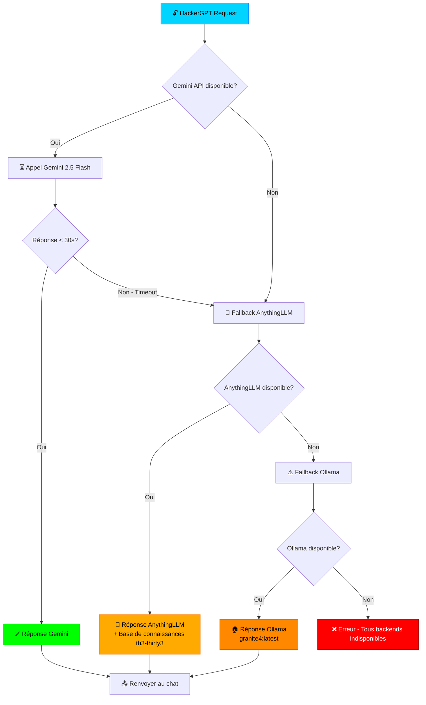

# Architecture HackerGPT - Cascade de Fallback

## 🎯 Objectif
Fournir des réponses de sécurité de qualité maximale avec une disponibilité garantie grâce à une cascade intelligente de backends LLM.

## 🔄 Flux de décision

### Niveau 1 : Gemini 2.5 Flash (Priorité maximale)
- **Avantages** :
  - Modèle le plus puissant et à jour
  - Spécialisé en sécurité avec le persona HackerGPT
  - Accès aux dernières connaissances
  
- **Contraintes** :
  - Nécessite connexion internet
  - Timeout après 30 secondes
  - Dépendant de la disponibilité de l'API Google

### Niveau 2 : AnythingLLM th3-thirty3 (Fallback intelligent)
- **Avantages** :
  - Accès à la base de connaissances personnalisée
  - RAG avec embeddings locaux
  - Contexte projet th3-thirty3
  - Plus rapide que Gemini en cas de surcharge
  
- **Contraintes** :
  - Nécessite AnythingLLM configuré
  - Dépend du modèle backend configuré dans AnythingLLM

### Niveau 3 : Ollama granite4 (Dernier recours)
- **Avantages** :
  - Totalement local et offline
  - Aucune dépendance réseau
  - Toujours disponible
  
- **Contraintes** :
  - Pas d'accès à la base de connaissances
  - Qualité de réponse moindre
  - Nécessite ressources locales

## 📊 Statistiques de performance attendues

| Backend | Temps moyen | Qualité | Disponibilité |
|---------|-------------|---------|---------------|
| Gemini 2.5 Flash | 5-15s | ⭐⭐⭐⭐⭐ | 98% |
| AnythingLLM th3-thirty3 | 8-20s | ⭐⭐⭐⭐ | 95% |
| Ollama granite4 | 10-30s | ⭐⭐⭐ | 99.9% |

## 🎨 Messages utilisateur

| Étape | Message affiché |
|-------|----------------|
| Début | `⏳ HackerGPT analyse en cours avec Gemini... (Fallback: AnythingLLM th3-thirty3)` |
| Gemini timeout | `🔄 Gemini lent, bascule vers AnythingLLM...` |
| AnythingLLM activé | `🤖 Utilisation de la base de connaissances th3-thirty3...` |
| Ollama activé | `⚠️ Mode local activé (Ollama)` |
| Échec total | `❌ Tous les backends sont indisponibles` |

## 💡 Recommandations

1. **Garder AnythingLLM en ligne** pour un fallback efficace
2. **Configurer un modèle puissant** dans AnythingLLM (GPT-4o recommandé)
3. **Alimenter la base de connaissances** th3-thirty3 avec docs de sécurité
4. **Monitorer les logs** pour identifier les patterns de fallback
